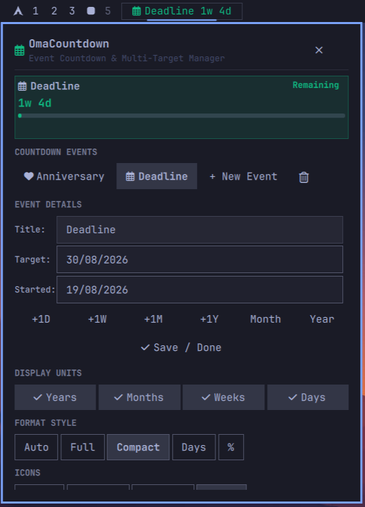

# OmaCountdown ⏳

An elegant, highly customizable status bar countdown timer plugin for **[Omarchy](https://omarchy.org/)** (Arch Linux + Hyprland + Quickshell).

<p align="center">
  
</p>

Track your most important milestones, exams, vacations, and annual events with calendar-accurate precision, intelligent natural-language date parsing, customizable units (Years, Months, Weeks, Days), high-contrast visual progress tracks, and dynamic green-to-red timeline gradient colors.

---

## ⚡ One-Command Installation

To install and immediately enable OmaCountdown on your Omarchy status bar, run:

```bash
omarchy plugin add https://github.com/thepathless/omacountdown.git --enable
```

> [!TIP]
> You can also update the plugin at any time with:
> ```bash
> omarchy plugin update omacountdown
> ```

---

## ✨ Features

- **Multi-Countdown Event Manager**: Add, edit, delete, and switch between multiple saved events (e.g. *NEET PG*, *Vacation*, *Birthdays*, *Projects*) directly from the status bar.
- **Natural Language & Multi-Format Date Parser**: Type dates naturally in any format:
  - Relative keywords: `today`, `tomorrow`, `yesterday`, `next week`, `+30d`, `-1y`
  - Day-First / Month-First: `27/01/2027`, `27 Jan 2027`, `1st of August 2027`, `29th november`, `Aug 21`
  - Smart Year Auto-Inference: Typing `27 jan` automatically targets upcoming `2027` without manual year input.
  - Auto-Formatting on Enter/Blur: Instantly normalizes phrases into standard `DD/MM/YYYY`.
- **Approach A Deterministic Progress Calculation**:
  - Optional **`Started:`** baseline field to measure exact preparation progress from when you began studying or working.
  - Leaves starting line at **0%** on Day 1 for new countdowns and fills smoothly toward **100%**.
  - Annual mode (`-1y` or previous year date) for birthdays & anniversaries.
- **Granular Date Units (Single-Row Toggles)**:
  - Toggle any combination of **`[✓ Years]` `[✓ Months]` `[✓ Weeks]` `[✓ Days]`** with smooth mathematical rollover.
- **4 Standard Presentation Styles**:
  - `Ghost` — Minimal monochrome text in standard theme color.
  - `Accent Text` — Text colored with the dynamic Green-to-Red timeline gradient.
  - `Linear Progress` — High-contrast background progress fill with crisp foreground text.
  - `Dynamic Progress` — Both text and background track dynamically colored with the timeline gradient.
- **Calibrated Timeline Gradient**:
  - Events > 60 days away render in **100% Crisp Green (`#50fa7b`)**, transitioning smoothly through Lime (`#a3e635`), Warm Amber (`#f1fa8c`), Vivid Orange (`#ffb86c`), down to Urgent Red (`#ff5555`) in the final 3 days.
- **Native Wayland Keyboard Layer-Shell Focus**:
  - Built with Omarchy's `KeyboardPanel` (`WlrLayershell.keyboardFocus`) for seamless typing, backspace, and cursor navigation on Hyprland.
- **Pure Omarchy Theme Integration**:
  - Uses authentic monochrome Nerd Font glyphs (`\uf0f1` Stethoscope, Calendar, Target, Graduation Cap, Book, Star, Plane, Heart, Bolt, Clock).

---

## 🎮 Controls & Shortcuts

| Action | Trigger | Description |
| :--- | :--- | :--- |
| **Open Settings Popup** | **Left-Click** / **Right-Click** | Opens the event manager and customization card |
| **Cycle Countdown Event** | **Middle-Click** | Switches to the next countdown event in your list |
| **Cycle Events on Bar** | **Mouse Wheel** | Scroll over the widget to cycle through events |
| **Confirm / Save Edit** | **Enter Key** or **`✓ Save / Done`** | Saves event details and normalizes date inputs |

---

## 🛠️ CLI & Management Commands

```bash
# List installed plugins
omarchy plugin list

# Validate plugin folder
omarchy plugin validate ~/.config/omarchy/plugins/omacountdown

# Enable or disable widget
omarchy plugin enable omacountdown --section left
omarchy plugin disable omacountdown

# Move widget on bar
omarchy bar move omacountdown --section center
```

---

## 📄 License

MIT License. Designed with ❤️ for the Omarchy Linux desktop.


