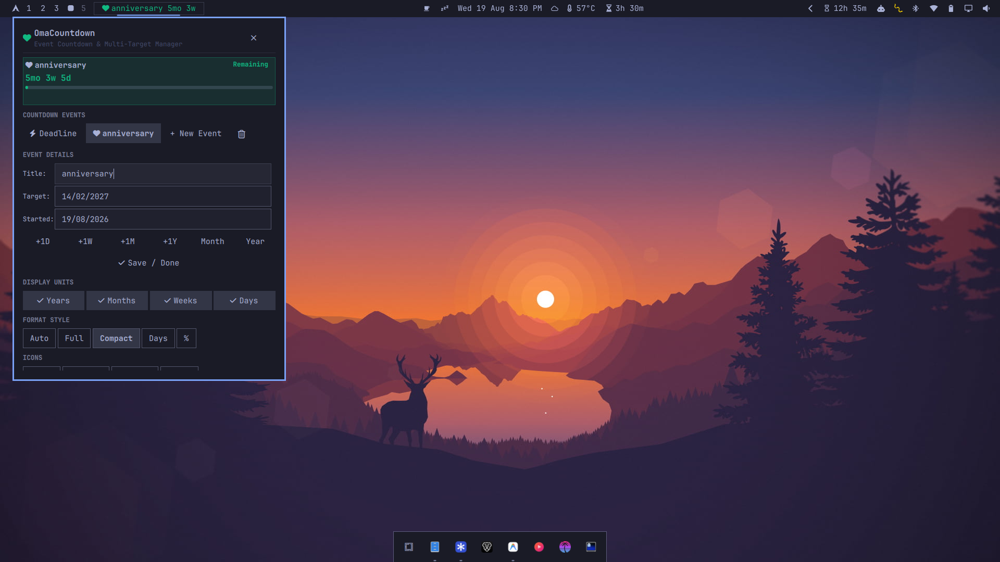
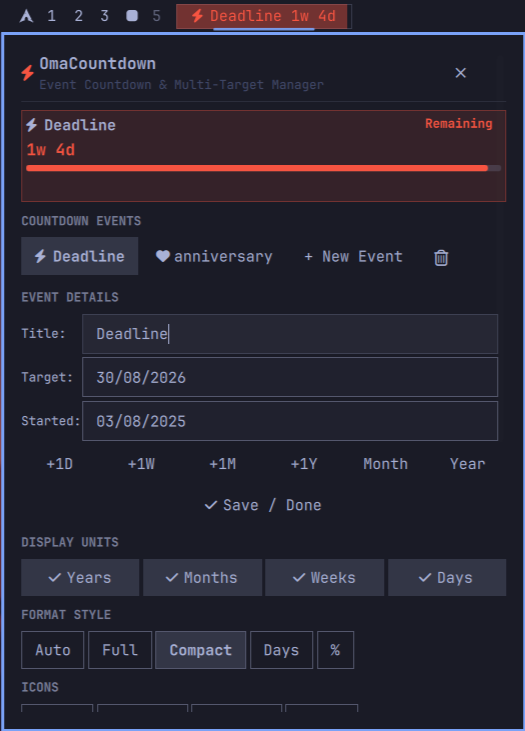
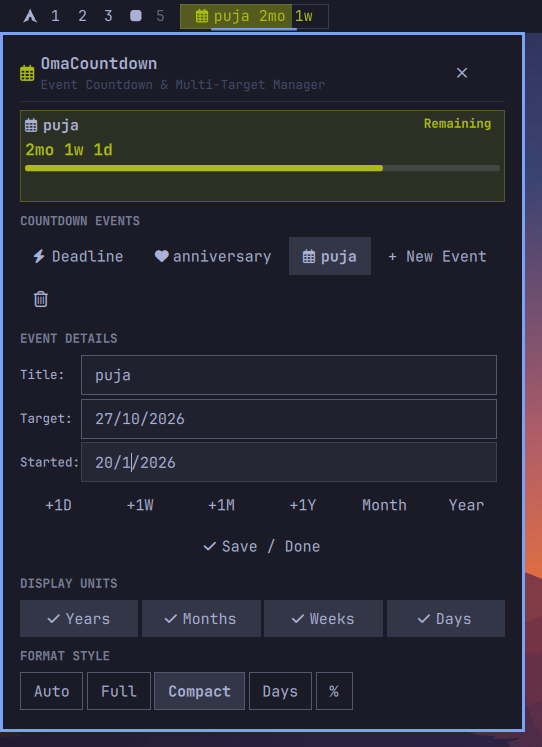
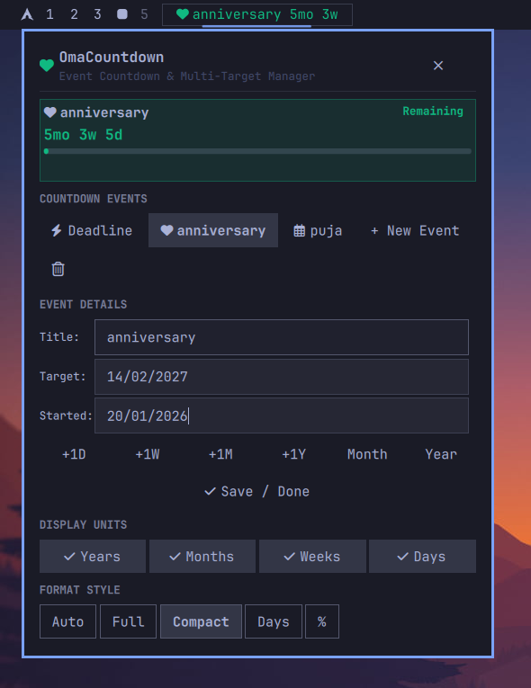
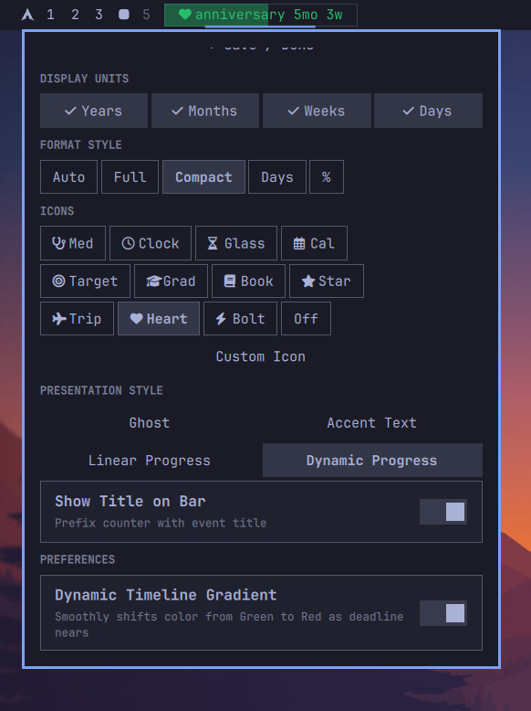

# OmaCountdown ⏳

<p align="center">
  <b>A sleek, calendar-accurate multi-target countdown timer plugin for the <a href="https://omarchy.org/">Omarchy Desktop Shell</a>.</b><br>
  <i>Built natively for Omarchy · Hyprland Wayland Compositor · Quickshell QML</i>
</p>

<p align="center">
  
  
  
</p>

---

<p align="center">
  
</p>

---

## ⚡ 1-Command Quick Installation

Install and immediately activate **OmaCountdown** on your Omarchy status bar with a single command:

```bash
omarchy plugin add https://github.com/thepathless/omacountdown.git --enable
```

> [!TIP]
> **Updating:** You can pull the latest improvements at any time by running:
> ```bash
> omarchy plugin update omacountdown
> ```

---

## 📸 Visual Tour & Key Features

### 1. Multi-Target Event Manager & Live Hero Card
Track exams, milestone deadlines, birthdays, and anniversaries simultaneously. Switching active countdowns dynamically updates the status bar in real time.

<p align="center">
  
</p>

- **Dual-Orientation Date Parser**: Supports natural phrases (`today`, `tomorrow`, `yesterday`, `21st of aug`, `29th november`, `+30d`, `-1y`).
- **Auto-Formatting**: Typing relative terms automatically resolves and standardizes into `DD/MM/YYYY` upon pressing Enter or losing focus.
- **Approach A Baseline**: Measure progress from your actual starting date with the optional `Started:` anchor.

---

### 2. Granular Unit Toggles & 5 Format Styles
Customize unit granularity with single-click toggle chips.

<p align="center">
  
</p>

- **Display Units**: Select any combination of `[✓ Years] [✓ Months] [✓ Weeks] [✓ Days]`.
- **5 Adaptive Formats**:
  - `Auto` — Smart adaptive display of the most relevant remaining units.
  - `Full` — Shows all enabled units (e.g. `1y 2mo 1w 4d`).
  - `Compact` — Shows the top 2 units for minimal bar footprint (e.g. `1w 4d`).
  - `Days Only` — Displays total accumulated days (e.g. `11d`).
  - `Progress %` — Direct completion percentage towards your goal.

---

### 3. Nerd Font Typography & Custom Emoji
Personalize your milestones with built-in monochrome Nerd Font glyphs or your own custom emoji.

<p align="center">
  
</p>

- **Built-in Glyphs**: Medical Stethoscope (`\uf0f1`), Calendar, Target, Graduation Cap, Book, Star, Flight, Heart, Bolt, Clock.
- **Custom Glyph / Emoji**: Type any custom unicode emoji (e.g. 🎯, 🎂, 🚀, 💍) or Nerd Font glyph.

---

### 4. 4 Presentation Styles & Linear 5-Stop Gradient
Choose how the widget renders on your status bar with four distinct visual aesthetics.

<p align="center">
  
</p>

- **Styles**:
  - `Ghost` — Minimal monochrome text in standard theme foreground color.
  - `Accent Text` — Text colored with the dynamic urgency timeline gradient.
  - `Linear Progress` — High-contrast background progress fill with crisp foreground text.
  - `Dynamic Progress` — Both text and background track dynamically colored with the gradient.

---

## 🎨 Dual-Urgency Gradient Spectrum

OmaCountdown calculates urgency using a **Dual-Urgency Engine** that takes the highest alert level between **Percentage of Time Elapsed** and **Days Remaining**:

$$\text{Urgency} = \max(\text{Percentage Urgency},\ \text{Absolute Days Urgency})$$

The gradient uses Linear/Tailwind's 5-stop perceptual palette with zero muddy midpoints:

```
[0% - 50% Elapsed]        [50% - 70%]          [70% - 85%]         [85% - 93%]         [93% - 100%]
   #10b981      ──────►     #84cc16    ──────►   #f59e0b   ──────►   #f97316   ──────►    #f43f5e
(Vibrant Emerald)         (Fresh Lime)        (Rich Amber)        (Burnt Orange)      (Electric Rose)
```

| Time / Progress Stage | Alert Level | Rendered Color | Exact Hex |
| :--- | :--- | :--- | :--- |
| **$> 60$ Days / $< 50\%$ Elapsed** | **Safe / Healthy** | **Vibrant Emerald** | `#10b981` |
| **$30 - 60$ Days / $50\% - 70\%$** | **Steady Momentum** | **Fresh Lime** | `#84cc16` |
| **$14 - 30$ Days / $70\% - 85\%$** | **Focus Zone** | **Rich Golden Amber** | `#f59e0b` |
| **$7 - 14$ Days / $85\% - 93\%$** | **High Urgency** | **Vivid Burnt Orange** | `#f97316` |
| **$\le 7$ Days / $> 93\%$ Elapsed** | **CRITICAL DEADLINE** | **Electric Crimson Rose** | `#f43f5e` |

---

## 🎮 Controls & Shortcuts

| Action | Trigger | Description |
| :--- | :--- | :--- |
| **Open Settings Popup** | **Left-Click** / **Right-Click** | Opens the event manager and customization card |
| **Cycle Countdown Event** | **Middle-Click** | Switches to the next countdown event in your list |
| **Cycle Events on Bar** | **Mouse Wheel** | Scroll over the widget to cycle through events |
| **Confirm / Save Edit** | **Enter Key** or **`✓ Save / Done`** | Saves event details and normalizes date inputs |

---

## 🛠️ CLI & Management Commands

```bash
# List all installed Omarchy plugins
omarchy plugin list

# Validate plugin integrity
omarchy plugin validate ~/.config/omarchy/plugins/omacountdown

# Move widget on bar (left, center, right)
omarchy bar move omacountdown --section center

# Enable or disable widget
omarchy plugin enable omacountdown --section left
omarchy plugin disable omacountdown
```

---

## 📄 License

MIT License. Designed with ❤️ for the [Omarchy](https://omarchy.org/) Linux desktop.


